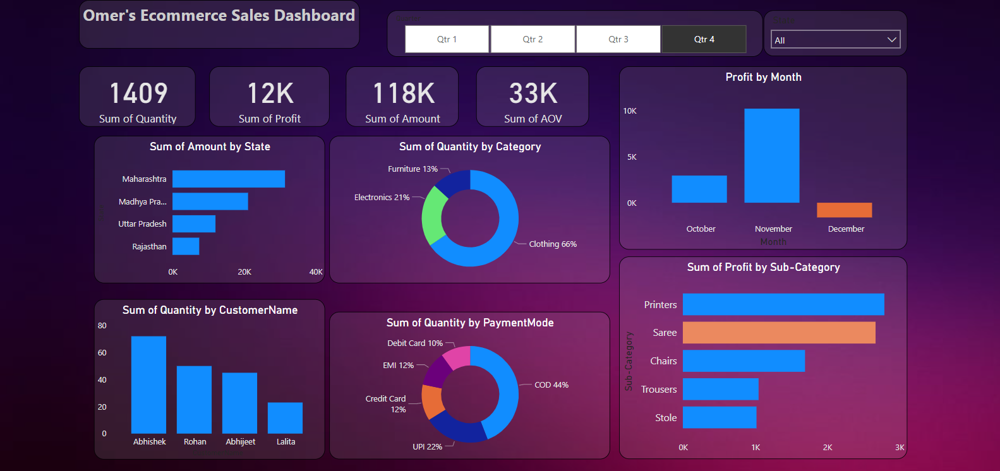

# E-commerce Sales Dashboard (Power BI)

An interactive Power BI dashboard for tracking and analysing the online sales of an e-commerce store.

## What it shows

- Headline KPIs: quantity sold, profit, sales amount and average order value
- Sales amount by state
- Quantity by product category and by payment mode
- Profit by month and by product sub-category
- Top customers by quantity
- Slicers for quarter and state, so every visual can be filtered together

## Report design

- One page built for a quick read: KPI cards on top, breakdowns below
- Bar, column and donut charts chosen to match each comparison
- Quarter and state slicers that filter every visual together
- Custom dark theme with a gradient background

## Files

| File | Description |
|---|---|
| `Omer Ecommerce Sale Dashboard.pbix` | Power BI report (open with Power BI Desktop) |
| `dashboard-preview.png` | Preview of the dashboard |
| `Omer's Ecommerce Sales Dashboard.png` | Original full-screen capture |

## Tools

Power BI Desktop

## Author

**Omer Naeem Khan** — Data Analyst
[GitHub](https://github.com/OmerNaeemKhan) · [LinkedIn](https://www.linkedin.com/in/omer-khan-03833749)
